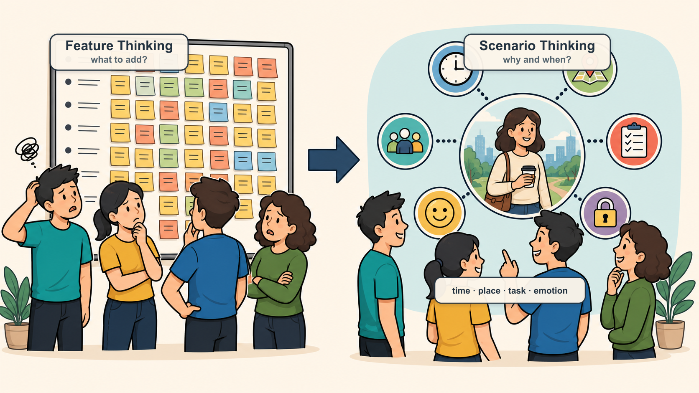
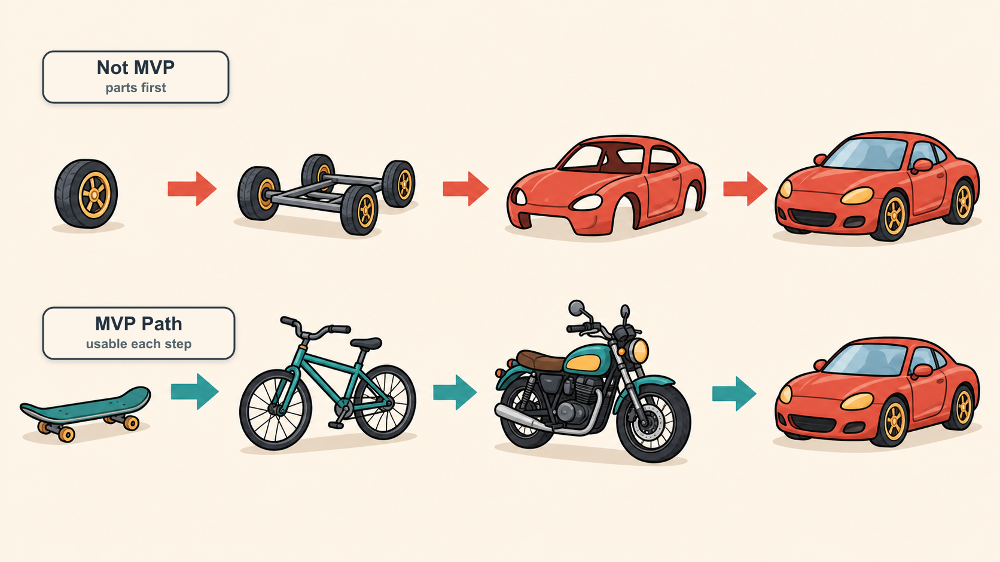
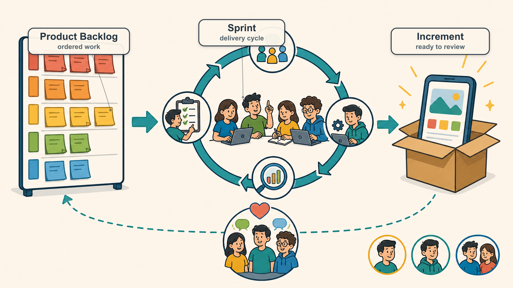
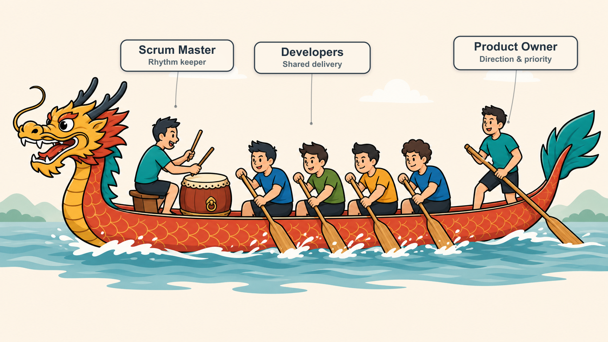
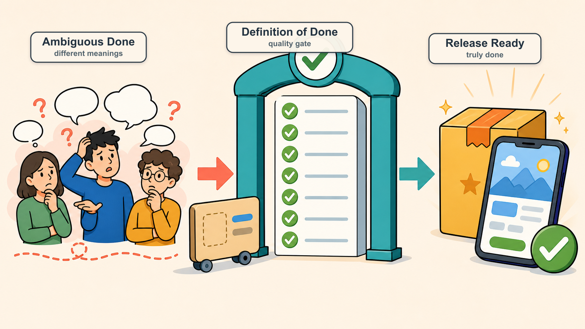
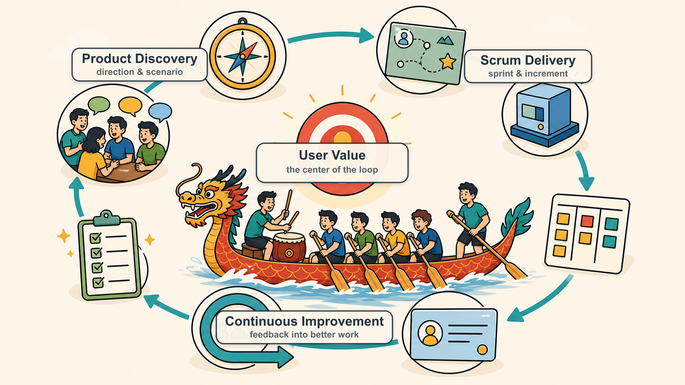

# 敏捷产品研发理念和方法

> 敏捷不是把会议名字换成英文，也不是给团队套一层“高级流程”。它真正想解决的是：需求总在变、用户不一定买账、团队资源又有限的情况下，我们怎么少走弯路，更快做出真正能落地的产品。

---

## 一、很多团队不是不努力，而是努力的方式有问题

做产品研发的人，大概率都见过这些场面：

- 实验室里跑得好好的，一到客户现场就各种掉链子
- 产品憋了几个月，终于上线了，结果用户不怎么用
- 计划排得很漂亮，实际进度一路延迟
- 不同客户要的东西不一样，为了都照顾到，团队只好硬着头皮维护好几个版本
- 产品说研发不理解业务，研发说产品需求没想清楚，测试夹在中间背锅
- 大家天天很忙，但产品到底有没有往正确方向走，其实谁心里都没底

这时候团队最容易做的事情，是继续加码：

> 多开几个会，多写几份文档，多排几张计划表，再催一催进度。

但很多时候问题不在这里。

真正麻烦的是：

> **我们太晚接触真实用户，太晚发现方向偏了，太晚知道哪些东西其实没价值。**

敏捷要解决的，正是这类问题。

---

## 二、敏捷到底想干什么

我更愿意把敏捷理解成一句话：

> **用更小的步子、更快的反馈、更持续的改进，降低产品研发里的不确定性。**

真实世界里，需求不会老老实实按需求文档走，用户也不会完全按我们想象的方式用产品。市场会变，客户会变，团队能力也会变。

所以敏捷不是假装一开始就能把所有事情想清楚，而是承认：

> 很多事情只有做出来、拿出去、让真实用户用一用，才知道到底对不对。

因此，敏捷最关心三件事：

1. **价值**：这个东西到底有没有用？用户愿不愿意用？客户愿不愿意买单？
2. **反馈**：我们能不能早点知道做对了还是做偏了？
3. **改进**：发现问题以后，团队能不能真的调整，而不是下次继续踩同一个坑？

---

## 三、敏捷宣言：本质上是在说“怎么取舍”

敏捷宣言里有四句话：

- **个体和互动 Individuals and Interactions** 高于 流程和工具 Processes and Tools
- **可工作的软件 Working Software** 高于 详尽的文档 Comprehensive Documentation
- **客户合作 Customer Collaboration** 高于 合同谈判 Contract Negotiation
- **响应变化 Responding to Change** 高于 遵循计划 Following a Plan

这里千万别理解成“流程不重要、文档不重要、计划不重要”。

它真正想说的是：这些东西当然重要，但当它们和真实价值冲突时，我们要知道该保谁。

比如：

- 文档写得再完整，用户不用，还是白搭
- 计划排得再细，市场变了，也得敢改
- 工具买得再贵，团队不沟通，照样低效
- 合同边界谈得再清楚，如果客户问题没解决，项目也很难算成功

所以敏捷不是反流程，而是反“流程正确但结果没用”。

---

## 四、产品管理才是敏捷的起点

很多团队一说敏捷，第一反应就是 Sprint、站会、看板、Scrum Master。

这些当然重要，但如果产品方向本身就是糊的，后面流程跑得越顺，可能只是更快地跑偏。

所以在进入研发节奏之前，产品上至少要先想清楚三个问题。

### 1. 做什么：一句话讲不清，基本就还没想清

不要一上来就说：

> “我们要做一个智能管理平台。”

这种话听起来很大，但没什么信息量。

更好的说法应该接近：

> “我们要帮连锁酒店前台减少重复接待工作，让客人能自助完成入住。”

一句话定位的价值在于，它能帮团队快速判断：

- 我们到底服务谁？
- 核心问题是什么？
- 产品边界在哪里？
- 哪些需求该接，哪些需求该拒？

定位不是写给老板看的 PPT 金句，而是团队每天做取舍的依据。

### 2. 为谁做：别把“用户”说得太抽象

“用户需要这个功能”这句话，在产品会上经常出现，但它其实很危险。

因为“用户”太泛了。

我们要继续往下问：

- 到底是哪类用户？
- 他在什么场景下需要？
- 这个问题对他有多痛？
- 他现在是怎么绕过去的？
- 他愿不愿意为了更好的解决方案付出成本？

用户越具体，产品判断越不容易飘。

### 3. 做到什么程度：别一开始就镀金

很多产品早期不是死于功能太少，而是死于想做得太全。

团队会觉得：

> 这个以后可能有用，那个客户也许会要，这个能力先留个口子……

结果第一个版本迟迟出不来，等终于做完了，才发现核心假设根本没验证。

所以早期最重要的不是“完整”，而是先验证：

> **这个方向到底有没有价值？用户到底愿不愿意用？**

“做到什么程度”其实是在帮团队划线：

- 哪些是必须有的？
- 哪些是锦上添花？
- 哪些现在做只是自我感动？

这就是敏捷里反复说“不镀金”的原因。

---

## 五、从功能思维切到场景思维

很多产品讨论容易陷入一个坑：

> “要不要加这个功能？”

但更靠谱的问题应该是：

> “用户在什么场景下会用它？这个功能能不能解决当时的问题？”

场景不是一句“用户使用时”就完事了。一个真实场景里通常有：

- 时间
- 地点
- 人物
- 任务
- 情绪
- 环境限制

比如同样是吃饭：

- 早高峰赶地铁，手里拎着电脑包在早餐摊前排队，用户要的是别耽误时间、拿了就能走，最好还能边走边吃
- 中午开会开到一半才想起还没吃饭，用户在意的是外卖别迟到、汤别洒、选起来别太费脑子
- 晚上和朋友难得聚一顿，用户在意的就不只是吃饱了，还要环境舒服、味道在线、坐下来能好好聊

都是吃饭，但产品设计完全不是一回事。

沟通工具也一样。微信和钉钉都能发消息，但微信更偏生活社交，钉钉更偏组织协作。不是功能差异先出现，而是场景差异决定了产品长成不同的样子。

所以别急着堆功能。先把关键场景想透，很多取舍自然就清楚了。

---

## 六、MVP：不是做一个“残缺版”，而是先验证最关键的事

MVP（Minimum Viable Product，最小可行产品）经常被误解成“先做个简陋版”。

这其实不太对。

MVP 不是粗糙，也不是半成品，而是：

> **用最小的产品范围，验证最关键的用户价值和业务假设。**

这张图很直观。

上面那种做法，是先做轮子、底盘、车壳，最后才有一辆车。问题是，前面很长时间用户都没法真正使用，团队也拿不到有效反馈。

下面那种做法，是先给用户一个滑板，再到自行车、摩托车、汽车。每一步都不完美，但每一步都能解决“移动”这个核心问题。

所以 MVP 的关键不是“少做点”，而是：

> **不要先做完整产品的一小块，而是先做一个能解决核心问题的最小产品。**

这个区别非常重要。

---

## 七、微信的例子：好产品往往是慢慢长出来的

今天我们看微信，会觉得它什么都有：聊天、朋友圈、公众号、支付、红包、小程序、视频号、企业微信生态……

但微信一开始并不是一个“超级 App”。

它早期版本非常克制：

- **V1.0**：导入通讯录、发送文字、发送图片、设置头像和昵称
- **V1.2**：好友备注、黑名单
- **V2.0**：语音消息
- **V2.1**：好友验证
- **V2.2**：查看附近的人
- **V3.0**：扫一扫
- **V4.0**：朋友圈
- **V4.5**：公众号
- **V5.0**：钱包、绑定银行卡
- **V6.0**：红包

它的演进路径大概是这样的：

1. 先解决熟人之间的即时沟通
2. 再用语音消息降低输入门槛
3. 再通过附近的人、扫一扫扩展连接方式
4. 再通过朋友圈形成社交内容网络
5. 再通过公众号连接内容和服务
6. 再通过支付和红包进入交易场景

这就是很典型的产品演进逻辑：

> **先把一个核心场景做透，再顺着用户行为和业务机会逐步扩展。**

如果微信一开始就想同时做聊天、朋友圈、公众号、支付、小程序，大概率会非常臃肿，也很难快速验证哪个场景真正成立。

这对我们做产品很有启发：

- 早期最怕什么都想做
- 版本规划不是功能清单越长越好
- 每次迭代都应该让产品更接近用户，而不是更接近我们脑子里的“大而全”

---

## 八、Scrum：把敏捷落到团队日常的一套框架

产品方向、核心场景、MVP 想清楚以后，接下来就需要一套协作机制，把想法持续变成交付成果。

Scrum 就是最常见的一种敏捷框架。

> Scrum 不是敏捷的全部，但它确实是很多团队落地敏捷时最容易上手的一套方法。

Scrum 主要回答三个问题：

1. 谁负责什么？
2. 团队按什么节奏推进？
3. 怎么判断东西真的完成了？

---

## 九、Scrum 团队：可以想象成一支龙舟队

Scrum 团队（Scrum Team）通常由三个角色组成：

- 产品负责人 Product Owner，简称 PO
- Scrum Master，简称 SM
- 开发团队 Developers / Development Team

我觉得龙舟队这个比喻特别形象。

### 1. PO：像掌舵的人，决定方向

龙舟上掌舵的人，不一定划得最多，但他决定船往哪里走。

PO 也是一样。

PO 的核心职责不是“提需求”，而是：

- 明确产品目标 Product Goal
- 判断什么最有价值 Value
- 管理产品待办列表 Product Backlog
- 排列需求优先级 Priority
- 验收团队交付成果 Acceptance

如果 PO 方向不清，团队越努力，可能跑得越偏。

### 2. Scrum Master：像打鼓的人，帮助团队保持节奏

龙舟里的鼓手不是直接划船的人，但他非常关键。

他通过鼓点让大家节奏一致，让队伍保持专注和协同。

Scrum Master 也是类似角色。

他的职责不是命令团队，而是：

- 维护 Scrum 机制有效运行
- 帮助团队发现和移除障碍 Impediments
- 引导团队持续改进 Continuous Improvement
- 保护团队免受不必要干扰
- 促进沟通和共识

好的 Scrum Master 不是“监工”，也不是“催进度专员”，而是教练、引导者和节奏守护者。

### 3. 开发团队：像划船的人，真正推动船前进

真正让龙舟向前的，是一起划船的人。

开发团队也是产品交付的主体。

一个好的 Scrum 开发团队，通常具备这些特点：

- 跨职能 Cross-functional
- 自组织 Self-managing
- 对结果共同负责 Shared Accountability
- 能持续交付产品增量 Product Increment
- 愿意不断学习和改善工作方式

这里有个很重要的点：

> 团队不是一群“接任务的人”，而是一群共同对结果负责的人。

---

## 十、Scrum 怎么跑起来：从需求池到产品增量

Scrum 的运转，可以理解成一个循环：

> 先把重要的事情放进需求池，再选出一个迭代要做的事情，集中完成，交付可用结果，然后复盘改进。

### 1. 产品待办列表 Product Backlog

Product Backlog 可以理解成产品的“需求池”。

但它不是把所有需求一股脑扔进去就完了，而应该是一个动态排序的列表。

一个健康的 Product Backlog 通常具备：

- 价值清晰
- 优先级明确
- 条目粒度合适
- 持续更新
- 所有人可见，但主要由 PO 维护

Product Backlog 最核心的问题是：

> 现在做什么，最能给用户和业务带来价值？

### 2. 产品待办梳理 Product Backlog Refinement

Product Backlog Refinement，简称 PBR，可以理解为“需求梳理会”或“待办梳理”。

它的作用，是让需求从模糊变清楚，从大块变小块，从想法变成团队可以执行的工作。

通常包括：

- 拆分大型需求 Epic
- 补充用户故事 User Story
- 明确验收标准 Acceptance Criteria
- 识别依赖关系 Dependencies
- 估算工作量 Estimation
- 调整优先级 Priority

如果没有 PBR，Sprint Planning 很容易变成现场吵需求、现场猜工作量，最后大家带着一堆不确定性开干。

### 3. 迭代 / 冲刺 Sprint

Sprint，中文常翻译为“迭代”或“冲刺”，通常持续 2~4 周。

在一个 Sprint 中，团队围绕一个明确目标，完成一批经过选择和澄清的工作。

Sprint 的关键是稳定节奏：

- 开始前目标清楚
- 进行中尽量减少随意插入
- 结束时要有可用产出

它不是说 Sprint 期间绝对不能变，而是不要让团队每天都被新需求打断。否则所谓迭代，就会变成持续救火。

### 4. 迭代待办列表 Sprint Backlog

Sprint Backlog 是当前 Sprint 要完成的工作清单。

它来自 Product Backlog，但不是 PO 单方面塞给团队的，而是团队基于目标、优先级和自身能力共同确认的。

Sprint Backlog 关注的问题是：

> 这一轮我们具体怎么把价值交付出来？

### 5. 每日站会 Daily Scrum / Daily Stand-up

每日站会不是给领导汇报工作的会议。

它真正的目标是：

- 对齐进展
- 暴露障碍
- 快速协调
- 保持团队节奏

建议控制在 15 分钟内，并围绕 Sprint 目标展开。否则很容易变成每个人轮流念流水账，听起来很勤奋，实际没什么用。

### 6. 产品增量 Product Increment

每个 Sprint 结束时，团队都应该产生一个产品增量 Product Increment。

它不一定马上发布，但必须是“潜在可发布”的 Potentially Shippable。

也就是说：

> 它应该是真的可用，而不是“代码写完了，但还不能交付”。

---

## 十一、用户故事：把需求拉回用户语言

用户故事 User Story 是敏捷里非常重要的概念。

它的价值在于：把团队从“功能视角”拉回到“用户视角”。

常见写法是：

> 作为某类用户，我希望完成某件事，从而获得某种价值。

例如：

> 作为点外卖的用户，我希望看到附近可配送的餐厅，从而快速完成下单选择。

这样写的好处是，团队不会只盯着“做一个餐厅列表功能”，而会继续往下想：

- 附近怎么定义？
- 哪些餐厅当前能配送？
- 用户最关心距离、价格、评分还是配送时间？
- 用户看到列表后下一步要做什么？

好的用户故事通常具备这些特点：

- 用户能理解
- 可以验证
- 对应明确场景
- 范围尽量小
- 可以独立测试
- 尽量减少和其他故事的耦合

用户故事写得好，很多需求歧义会提前暴露；写得不好，团队就只能靠猜。

---

## 十二、完成的定义 DoD：别让“做完了”变成扯皮

Definition of Done，简称 DoD，中文通常叫“完成的定义”。

它回答的是一个非常现实的问题：

> 到底什么才叫完成？

在很多团队里，“完成”这个词特别容易产生歧义：

- 研发说：我代码写完了
- 测试说：我还没测完
- 产品说：这和我想的不一样
- 运维说：这个还不能上线

DoD 就是为了统一大家对“完成”的理解。

一个团队的 DoD 可能包括：

- 代码开发完成 Code Complete
- 自测完成 Self-tested
- 测试通过 QA Passed
- 缺陷修复完成 Defects Fixed
- 关键文档更新 Documentation Updated
- 产品验收通过 Product Accepted
- 满足发布要求 Release Ready

DoD 不是形式主义，它其实是团队的质量底线。

如果一项工作不满足 DoD，就不应该被算作真正完成。否则“做完了”这三个字，迟早会变成团队之间互相扯皮的导火索。

---

## 十三、回顾会议 Retrospective：别让同一个坑反复踩

Retrospective，中文通常叫“回顾会议”或“复盘会”。

它一般发生在每个 Sprint 结束后，目标不是追责，而是改进。

一次好的回顾，应该讨论：

- 这一轮哪些做得好？
- 哪些地方让大家很痛苦？
- 哪些问题反复出现？
- 下个 Sprint 我们具体改哪一两件事？

这里最重要的是两点。

### 1. 对事不对人

如果回顾会变成批斗会，大家以后就不会讲真话。

团队必须建立心理安全感 Psychological Safety，敢于暴露问题，才有可能真正改进。

### 2. 行动项要可跟踪

不要只说“以后沟通要更好”。

这句话太空了。

更好的行动项是：

- 下个 Sprint 每周二、周四固定做一次需求澄清
- 所有用户故事进入 Sprint 前必须有验收标准
- 遇到阻塞超过半天必须在群里同步

回顾会议的价值不在于聊了多少，而在于下次是否真的变好了。

---

## 十四、把产品管理和 Scrum 串起来看

前面讲了产品定位、场景、MVP，也讲了 Scrum 的角色、节奏和术语。

这些东西不是孤立的。

可以这样串起来看：

1. **产品定位** 决定团队要往哪里走
2. **场景分析** 帮助团队理解用户为什么需要
3. **MVP** 帮助团队用最小成本验证核心价值
4. **产品待办列表 Product Backlog** 把产品想法变成有序需求池
5. **用户故事 User Story** 把需求翻译成用户能理解的价值
6. **迭代 Sprint** 让团队用固定节奏持续交付
7. **完成的定义 DoD** 保证交付质量不打折
8. **回顾会议 Retrospective** 让团队持续改进

所以敏捷不是单独的“研发流程”，而是把产品判断、团队协作和持续交付串起来的一套系统。

---

## 十五、给 PO 的一些建议

如果你是 PO，最重要的不是把需求收集得越多越好，而是做好取舍。

一些很实用的建议：

- 目标一定要讲清楚，不清楚就反复确认
- 优先级管理是头等大事，不要把它甩给研发
- 风险越早暴露越好，丑话要说在前头
- 不要只看用户说了什么，要看用户真正要解决什么
- 重要问题尽量准备多个方案，让决策者做选择题
- 不要追求第一次就完美，要尽早验证、尽早反馈、持续改进
- 越晚接触真实用户，风险越大

判断需求价值时，可以重点看两个方向：

- 用户或客户愿意为它买单的程度
- 实现它需要付出的成本、复杂度和机会成本

说白了，PO 最核心的能力不是“会提需求”，而是知道什么值得做、什么应该先做、什么现在不要做。

---

## 十六、给 Scrum Master 的一些建议

如果你是 Scrum Master，千万不要把自己变成“催进度的人”。

真正优秀的 Scrum Master，更像是：

- 教练 Coach
- 引导者 Facilitator
- 服务型领导 Servant Leader
- 变革推动者 Change Agent
- 团队节奏守护者 Rhythm Keeper

你的目标不是替团队解决所有问题，而是帮助团队形成解决问题的能力。

当你看到团队存在延期风险时，可以先问：

- 风险是什么？
- 是目标不清，还是工作量低估？
- 是需求变更，还是协作阻塞？
- 团队是否已经看见这个问题？
- 谁最适合推动解决？
- 我应该直接介入，还是通过提问引导团队自己解决？

Scrum Master 的水平，往往体现在：

> 既不放任问题恶化，也不剥夺团队成长的机会。

---

## 十七、我最认同的敏捷价值观

敏捷真正能跑起来，靠的不只是流程，更是团队共同认可的一组工作理念：

- 信守承诺 Commitment
- 持续改进 Continuous Improvement
- 目标明确 Clear Goals
- 结果共担 Shared Accountability
- 平等透明 Transparency
- 积极乐观 Positive Attitude
- 追求卓越 Excellence
- 实事求是 Pragmatism

这些词看起来有点“虚”，但在真实团队里非常具体。

比如：

- 目标不清，就会反复返工
- 不透明，就会互相猜测
- 不共担，就会互相甩锅
- 不持续改进，问题就会一轮一轮重复

---

## 十八、最后总结

敏捷不是为了让团队看起来更先进，也不是为了多开几个会。

它真正想帮助团队做到的是：

> **围绕用户价值，先做最重要的事；用小步快跑降低风险；用真实反馈修正方向；用持续改进让团队越来越强。**

如果只记住一句话，我希望是：

> **敏捷的核心不是快，而是更早知道什么是对的，然后更快把它做好。**
